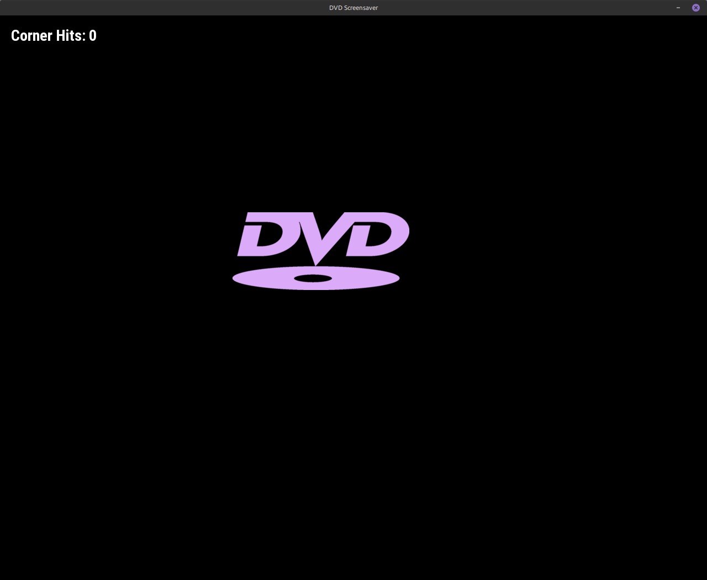

# DVD screensaver

Here is a complete `C` program using `SDL2` that recreates the classic DVD screensaver.



To make the color-changing mechanic work properly, this code uses `SDL_SetTextureColorMod()`. Because this function multiplies the tint color against the image pixels, this program needs a solid white `PNG` of the DVD logo with a transparent background (included).

It also includes an open TTF font package ("**Roboto**" by Google), used for the "corner-hit" counter in the upper left corner.

## Requirements

#### On Linux (Debian/Ubuntu):
```bash
sudo apt-get install libsdl2-dev libsdl2-image-dev
```

#### On macOS (using Homebrew):
```bash
brew install sdl2 sdl2_image
```

### Usage:

Run it with defaults (1280x1024):
```Bash
./dvd_screensaver
```

Run it with custom dimensions (e.g., 800x600):
```Bash
./dvd_screensaver 800 600
```

To compile and run it in one step:
```bash
make run
```

## Building

A `Makefile` is included for easy compilation.

To build the project, simply run:
```bash
make
```

To clean up build files:
```bash
make clean
```

### Controls
- **ESC:** Quit the screensaver.
- **Close Window (X):** Quit the screensaver.
